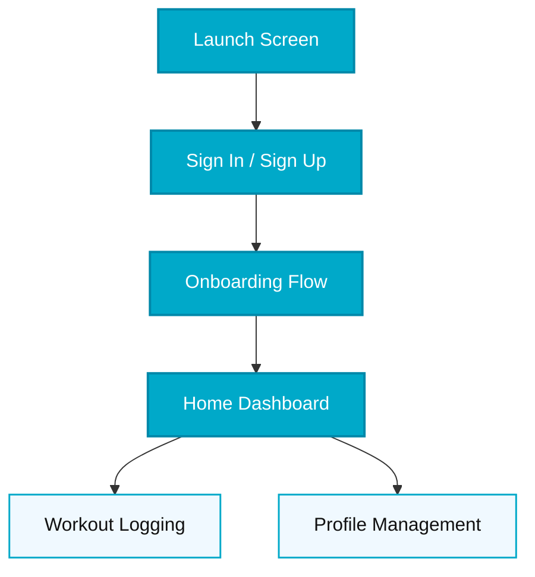
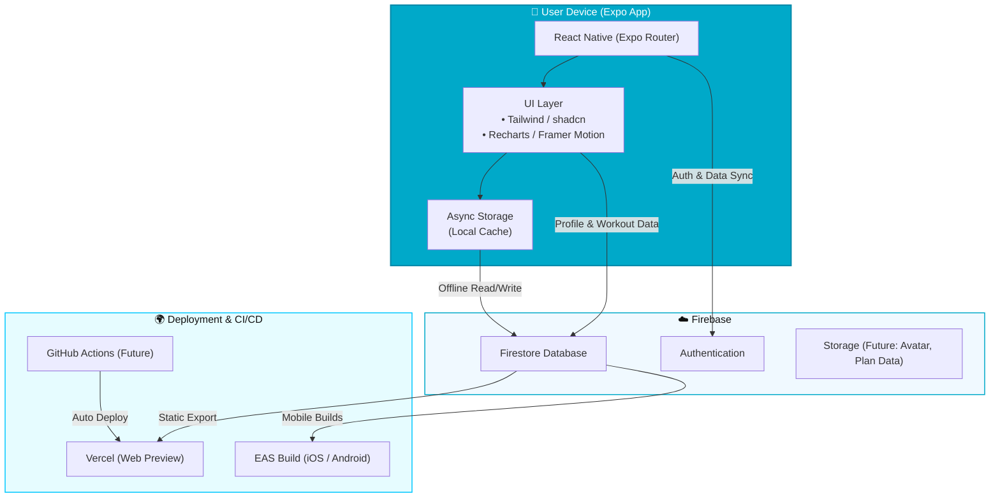

<p align="center">
  
</p>

<h1 align="center">🏋️‍♂️ LastRep</h1>

<p align="center">
  <i>Your coach, partner, and guide for training, recovery, and growth.</i>
</p>

---

## 🚀 Overview

**LastRep** is a holistic fitness app built with **React Native + Expo + Firebase**.  
It helps users train smarter — not just harder — by combining intelligent workout tracking, personalized planning, and mindful progress tracking.

---

## 🧩 Tech Stack

| Category | Technology |
|-----------|-------------|
| Framework | React Native (Expo Router) |
| Backend | Firebase Auth + Firestore |
| Language | TypeScript |
| UI | Tailwind / shadcn / custom teal-blue theme |
| Deployment | Vercel (Web Preview) |
| State | React Hooks + Firestore persistence |

---

## 💡 Core Features

✅ **Modern Onboarding Flow**  
Guides users through goal selection, training experience, and weekly availability.

✅ **Secure Authentication**  
Email/password sign-up and login using Firebase Auth (Google/Apple coming soon).

✅ **Profile Management**  
Users can store nickname, age, gender, height, weight, and units (metric/imperial) — with auto-conversion.

✅ **Workout Logging**  
Log exercises, sets, reps, and weight — synced directly to Firestore.

✅ **Dashboard**  
Home screen with “Start Workout,” recent history, and quick navigation.

✅ **Consistent Design Language**  
Unified teal-blue palette, elegant typography, and modern minimal UI.

---

## 🧭 User Flow



---

## 🏗️ App Architecture



---

## 🛠️ Local Development

### 1️⃣ Clone the repo

```bash
git clone https://github.com/kjeehwan/lastrep.git
cd lastrep
```

### 2️⃣ Install dependencies

```bash
npm install
```

### 3️⃣ Start the development server

```bash
npx expo start
```

### 4️⃣ Run in Expo Go or on web

Expo Go: Scan QR code from terminal
Web: npx expo start --web

---

## 🌍 Web Demo

Live Preview: https://lastrep.vercel.app
Accessible on desktop and mobile browsers — no Expo Go required.

---

## 🧱 Project Sprints (from Trello)

| Sprint            | Period          | Focus                                                           | Status         |
| ----------------- | --------------- | --------------------------------------------------------------- | -------------- |
| **Sprint 1**      | Oct 2 – 13      | Foundation – MVP scope, onboarding wireframes, tech stack setup | ✅ Complete     |
| **Sprint 2**      | Oct 14 – 20     | Authentication + Firestore profile storage                      | ✅ Complete     |
| **Sprint 3**      | Oct 21 – 27     | Profile polish + Settings + Offline cache                       | 🟡 In Progress |
| **Sprint 4**      | Oct 28 – Nov 3  | Home dashboard core (AI coach “blob”, weekly summary)           | ⏳ Planned      |
| **Sprint 5**      | Nov 4 – 10      | Workout detail logging and plan templates                       | ⏳ Planned      |
| **Sprint 6 – 12** | Nov 11 – Dec 31 | Progressive enhancements, analytics, and MVP readiness          | 🧩 Future      |
| **MVP Target**    | Dec 31          | Functional, data-driven fitness app ready for closed demo       | 🚀 Goal        |

---

## 🧭 Philosophy

“The rep that defines you isn’t the first — it’s the last.”

LastRep is built on integrity, discipline, and self-improvement —
a guide that motivates without ego, helps without judgment, and grows alongside you.

---

## 🤝 Contributing

Pull requests and feedback are welcome.
If you’d like to contribute features or fix issues, open a PR or issue in GitHub.

---

## 🪪 License

This project is licensed under the MIT License.

---

<p align="center"> <i>Built with integrity • Focused on growth • Powered by Expo</i> </p>
