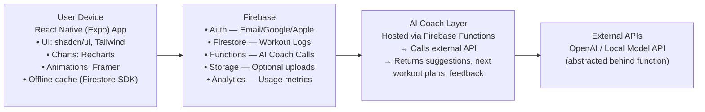

# 🏗️ System Architecture

## 🧩 Overview

The LastRep system is built on a modern, scalable architecture designed for speed, reliability, and ease of iteration.  
It leverages **React Native** for a cross-platform frontend and **Firebase** for a serverless backend, ensuring minimal maintenance overhead and seamless synchronization across devices.

---

## 📱 Client Layer (Frontend)

- **Framework:** React Native (Expo)
- **UI Components:** shadcn/ui, Tailwind
- **Charts & Visuals:** Recharts
- **Animations:** Framer Motion
- **Offline Support:** Firestore SDK caching
- **State Management:** Context + React Query (planned)

---

## ☁️ Backend Layer (Firebase)

- **Authentication:** Email / Google / Apple Sign-in  
- **Firestore:** Workout logs, progress data, and user profiles  
- **Cloud Functions:** Handles AI coach requests, workout suggestions, and secure server logic  
- **Cloud Storage:** Optional file uploads (e.g., form checks or profile images)  
- **Analytics:** User engagement and feature usage metrics  

---

## 🧠 AI Coach Layer

- Hosted within Firebase Cloud Functions  
- Connects to external AI APIs (e.g., OpenAI or a locally hosted model)  
- Handles:
  - Workout plan recommendations  
  - Training feedback and progression guidance  
  - Natural language conversation with users  

---

## 🌐 External API Layer

- **AI Providers:** OpenAI or locally hosted alternatives  
- **Abstraction:** All API calls are made via the AI Coach Layer to maintain security and modularity  

---

## 🧭 System Flow (Mermaid Diagram)

## 🔒 Security & Privacy

- End-to-end communication secured via HTTPS

- Firebase Authentication manages user identity and session tokens

- Firestore rules enforce per-user data isolation

- AI API keys stored securely in Firebase environment variables

## 🧰 Future Extensions

- Admin Dashboard: For monitoring user metrics and app health

- Offline AI Caching: Local inference for simple tasks

- Push Notifications: Personalized reminders via Firebase Cloud Messaging